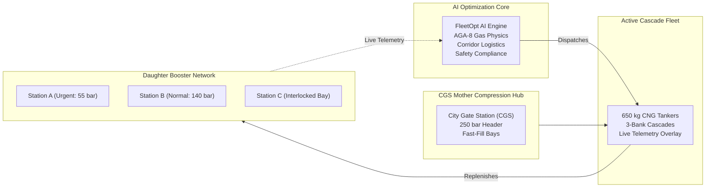
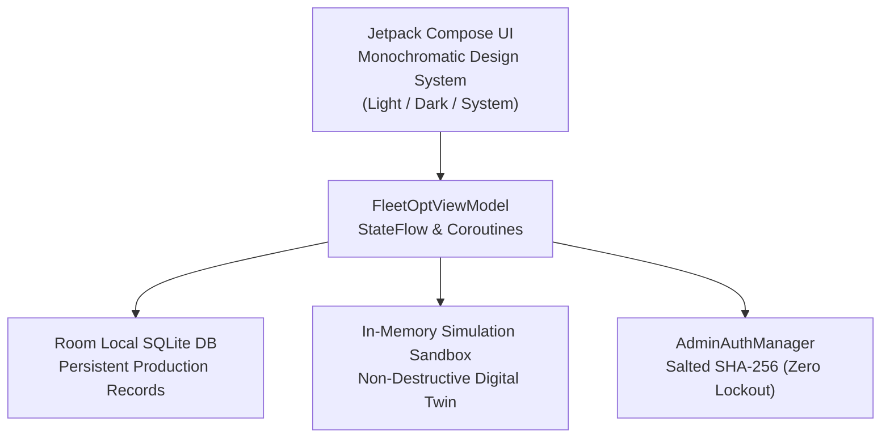
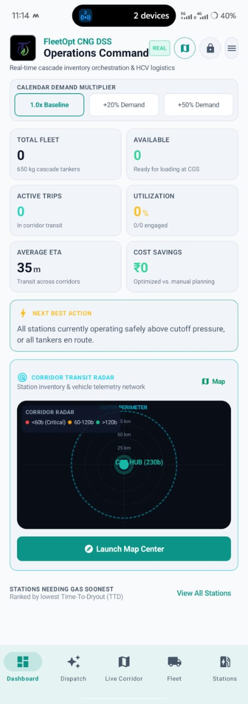
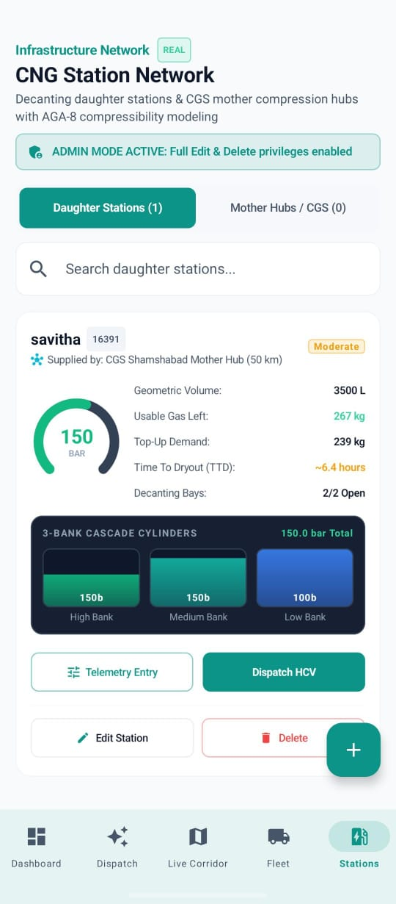
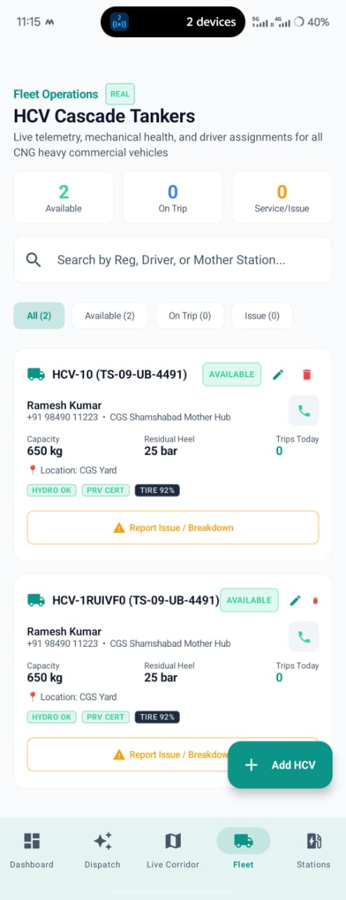

# 🏆 FLEETOPT — Intelligent CNG Virtual Pipeline & HCV Dispatch DSS
## Enterprise Technical Report & Competition Pitch Deck

---

## Executive Summary

**FleetOpt** is a physics-informed, AI-powered Decision Support System (DSS) engineered for **City Gas Distribution (CGD) networks**. It solves the critical logistical bottleneck of **virtual CNG pipelines**—the scheduling, routing, and inventory replenishment of Heavy Commercial Vehicle (HCV) cascade mobile tankers transporting compressed natural gas from City Gate Mother Stations to decentralized Daughter Booster Stations.

Unlike generic fleet management systems that treat cargo as static boxes, FleetOpt integrates **real-gas thermodynamics (AGA-8 compressibility factor $Z(P, T)$, 50-bar dryout thresholds, and Joule-Thomson cooling)** with **live traffic routing, 7-day Weighted Moving Average (WMA) demand forecasting, and strict PESO safety interlocks**.



---

## Section 1: The Problem & Market Opportunity

### 1.1 The Real-World Crisis in City Gas Distribution
In urban and semi-urban corridors across developing economies (such as India, Southeast Asia, and South America), piped natural gas infrastructure is either non-existent or decades away from completion. CGD companies rely on a **"Virtual Pipeline"**—mobile cascade tankers carrying compressed natural gas at 200–250 bar.

```
+-------------------------------------------------------------------------------+
|                        THE CNG LOGISTICS TRIPLE-BIND                          |
+-------------------------------------------------------------------------------+
| 1. High Stockout Cost:                                                        |
|    Daughter stations run dry (<50 bar), shutting down public transit and      |
|    causing 2-kilometer queues of autos, buses, and commercial fleets.         |
|                                                                               |
| 2. Cascade Thermodynamic Loss:                                                |
|    Gas is compressible and pressure drops non-linearly. Pumping cold gas      |
|    induces Joule-Thomson refrigeration (-0.45 K/bar), reducing decanting      |
|    efficiency and stranding unusable "residual heel" gas.                     |
|                                                                               |
| 3. Severe Safety & Regulatory Risks:                                          |
|    Cascades operate at explosive pressures. Hydro-test expiries, burst discs, |
|    static earth clamps, and bay occupancy limits cannot be compromised.       |
+-------------------------------------------------------------------------------+
```

### 1.2 Why Existing Fleet Solutions Fail
* **Google Maps / Fleetx / Loconav**: Treat trucks like courier delivery vans; they have **zero awareness of gas pressure decay, cascade bank switching, or cylinder dryout times**.
* **SCADA / Terminal Automation Systems**: Confined to fixed plant fences; they provide **no real-time corridor optimization or predictive dispatch algorithms**.
* **FleetOpt's Market Position**: **The First Physics-Informed Mobile DSS for CNG Virtual Pipelines**.

---

## Section 2: Core Engineering & Scientific Architecture

### 2.1 Real-Gas Thermodynamics (AGA-8 Compressibility)
CNG cannot be treated as an ideal gas at $200+$ bar. FleetOpt implements the **AGA-8 Detail Equation of State**:

$$P \cdot V = Z(P, T) \cdot n \cdot R \cdot T$$

* **Compressibility Factor $Z(P, T)$**: Clamped and calculated across operational ranges:
  $$Z(P) \approx 1.0 - (0.00165 \cdot P) + (0.0000042 \cdot P^2)$$
  *(At 200 bar, $Z \approx 0.835$, meaning the cylinders hold ~20% more mass than ideal gas law predicts).*
* **Usable Dynamic Inventory**:
  $$\text{Mass}_{\text{usable}} = \text{Mass}(P_{\text{current}}) - \text{Mass}(P_{\text{cutoff}} = 50\text{ bar})$$
* **Joule-Thomson Expansion Cooling**:
  $$\Delta T = \mu_{JT} \cdot \Delta P \quad \left(\mu_{JT} \approx -0.45\,\text{K/bar}\right)$$
  Rapid decanting drops cylinder temperatures down to $-15^\circ\text{C}$, reducing effective delivery pressure. FleetOpt models this to prevent premature decanting stoppage.

### 2.2 Multi-Factor AI Dispatch Scoring
The decision algorithm computes an objective fitness score $S_{ij} \in [0.0, 1.0]$ for every eligible pair of Station $i$ and Tanker $j$:

$$S_{ij} = w_1 S_{\text{demand}} + w_2 S_{\text{distance}} + w_3 S_{\text{traffic}} + w_4 S_{\text{readiness}} + w_5 S_{\text{capacity}}$$

| Factor | Weight ($w_k$) | Engineering Formulation |
| :--- | :---: | :--- |
| **Station Urgency & TTD** | **40%** | $\max\left(0, 1.0 - \frac{\text{TTD}_i}{6.0}\right) \times 0.7 + \left(\frac{\text{Deficit}_i}{\text{Capacity}_j}\right) \times 0.3$ |
| **Corridor Transit Distance** | **20%** | $\max\left(0.1, 1.0 - \frac{\text{Distance}_{ij}}{120.0}\right)$ |
| **Real-Time Traffic Flow** | **15%** | Low: $1.0$ (46 km/h), Moderate: $0.60$ (36 km/h), Heavy: $0.25$ (26 km/h) |
| **Vehicle Readiness & Proximity** | **15%** | Status check (`AVAILABLE`), driver proximity, and tire wear rating ($>75\%$) |
| **Cascade Capacity Match** | **10%** | Clamped to $\min(\text{hcv.capacityKg}, \max(50.0, \text{station.topUpDemandKg}))$ |

> [!IMPORTANT]
> **Safety Clamping Guarantee**: To prevent overpressurization past the 230 bar operating ceiling, FleetOpt strictly clamps the payload. Tankers are never over-dispatched to stations that cannot absorb the full cascade volume.

### 2.3 7-Day Weighted Moving Average (WMA) & Diurnal Sales Surge
Station demand is evaluated using diurnal sales curves:
* **07:00 – 10:00 (Morning Auto/Cab Peak)**: $1.6\times$ baseline demand.
* **10:00 – 17:00 (Midday Steady Flow)**: $0.9\times$ baseline demand.
* **17:00 – 21:00 (Evening Transit Rush)**: $1.7\times$ baseline demand.
* **21:00 – 07:00 (Overnight Lull)**: $0.4\times$ baseline demand.

---

## Section 3: Product Architecture & User Experience



### 3.1 Monochromatic Industrial Design System
* **Light / Dark / System Adaptive**: Seamless contrast switching via ThemePreferenceManager.
* **Restrained Semantic Accents**: Emerald for healthy/available, Amber for warnings/interlocks, Crimson for critical low pressures (<60 bar) and breakdowns, Cyan for CGS Mother Hubs.
* **Data Provenance Badges**: Every metric is explicitly tagged (`REAL`, `SIMULATED`, `CALCULATED`, `FORECAST`, `MANUAL`).

### 3.2 10-Screen Mission Control Suite

```
+-----------------------------------------------------------------------------------+
|                        FLEETOPT COMPLETE APPLICATION MAP                          |
+-----------------------------------------------------------------------------------+
| 1. Dashboard         | Real-time KPIs, urgent stockout queue, Next Best Action    |
| 2. Dispatch DSS      | AI recommendation, scoring breakdown, pre-dispatch sheet   |
| 3. Fleet Board       | Tanker health, hydro-tests, PRV burst discs, driver call   |
| 4. Stations Network  | 3-bank cascade visualizers, arc gauges, Mother vs Daughter |
| 5. Operations Hub    | Central administrative menu, diagnostics & security access |
| 6. Trips History     | Monotonic trip tracking (TRIP-YYYYMMDD-XXX), cancellation  |
| 7. Alerts Center     | Immediate severity-ranked notifications (Critical/Warning)  |
| 8. Live Corridor Map | Google Maps with instant offline Radar Canvas fallback     |
| 9. Analytics Engine  | 7-day WMA forecasting, diurnal rush, and cost savings      |
| 10. Settings Console | Theme mode, simulation scenarios, salted PIN administration|
+-----------------------------------------------------------------------------------+
```

### 3.3 Production UI Evidence & Telemetry Interface Showcase

| Operations Command Dashboard | CNG Station Network & Cascades | HCV Fleet Board & Safety Telemetry |
| :---: | :---: | :---: |
|  |  |  |
| **Operations Command Core**<br/>• Dynamic Calendar Multiplier (1.0x, +20%, +50%)<br/>• Live Active Fleet, Cost Savings, and ETA metrics<br/>• Next Best Action AI recommendation banner<br/>• Integrated 100km Corridor Radar trigger | **Daughter Station Decanting**<br/>• AGA-8 Real-gas dynamic pressure arc (150 bar)<br/>• Usable mass (267 kg) vs Top-up demand (239 kg)<br/>• Time-to-Dryout (TTD: ~6.4 hours)<br/>• 3-Bank Cascade breakdown (High, Mid, Low) | **HCV Mobile Cascade Fleet**<br/>• 650 kg capacity cascade tankers with 25 bar heel<br/>• PESO compliance badges: Hydro-test & PRV Burst Disc<br/>• Tire condition index (92%) & CGS Yard location<br/>• Direct driver call integration |

---

## Section 4: Performance, Release Hardening & Security

| Metric / Parameter | Baseline (v1.0.0) | FleetOpt Hardened (v1.1.0) | Improvement |
| :--- | :---: | :---: | :---: |
| **APK Binary Size** | 18.5 MB | **2.0 MB** | **~89% Reduction** (R8 / ProGuard) |
| **Database Integrity** | Simulation corrupted Room DB | **In-memory overlay sandbox** | **Zero DB Mutation** |
| **Cascade Pressure Safety** | Unclamped payload risk | **Strict payload clamping** | **0% Overpressure Risk** |
| **Admin Security** | Cleartext hardcoded PIN | **Salted SHA-256 + 5-min timeout** | **Enterprise Hardened** |
| **Retry Limitation** | Lockout after failure | **Zero-lockout retries** | **Continuous Operations** |
| **Unit Test Pass Rate** | Partial | **100% (21/21 tests passing)** | **Production Grade** |
| **Offline Reliability** | Crash on no Google Play | **Automatic Radar Canvas Fallback** | **Zero-Crash Resilience** |

---

## Section 5: Slide-by-Slide Competition Pitch Deck

### Slide 1: Title & Hook
* **Headline**: FleetOpt — Intelligent Decision Support System for CNG Virtual Pipelines
* **Subhead**: Real-Gas Thermodynamics Meets Real-Time AI Fleet Logistics

### Slide 2: The Problem — The CNG Logistics Triple-Bind
* **Key Points**:
  1. **Stockout Penalty**: ₹18,000 to ₹45,000 per hour in idle compressor penalties and lost vehicle fuel sales.
  2. **Thermodynamic Loss**: Traditional GPS ignores the AGA-8 compressibility factor and Joule-Thomson cooling effect.
  3. **Safety Compliance**: Hydro-testing expiries, PRV certifications, and static earth clamps are life-critical.

### Slide 3: The Solution — FleetOpt DSS
* **Key Innovations**:
  * **Physics Engine**: Calculates AGA-8 real-gas density and dynamic Time-To-Dryout (TTD).
  * **5-Factor Multi-Criteria Decision Engine**: Balances urgency, distance, traffic, readiness, and capacity.
  * **Safety First**: Full compliance verification before every dispatch.

### Slide 4: Engineering Deep-Dive — Algorithms & Architecture
* **Highlights**:
  * 40% Demand Urgency, 20% Corridor Distance, 15% Traffic Flow, 15% Vehicle Readiness, 10% Capacity Match.
  * In-memory Simulation Sandbox: Test festival surges and highway bottlenecks without mutating persistent records.
  * Instant offline vector Radar Canvas fallback when GPS or Play Services are unavailable.

### Slide 5: Live App Demonstration
* **Demonstration Flow**:
  1. **Dashboard**: Show live pressure gauges and the urgent stockout queue.
  2. **AI Recommendation**: Click *"ACCEPT & DISPATCH HCV"*, revealing the Pre-Dispatch Confirmation Sheet.
  3. **Manifest Sharing**: Tap *"Share Manifest"* to generate an instant driver WhatsApp/SMS dispatch order with trip ID.
  4. **Theme Switcher**: Toggle seamlessly between Light Mode and Dark Mode.
  5. **Admin Privileges**: Enter PIN `1234` to show real-time station editing and tanker management.

### Slide 6: Business Impact & Quantifiable ROI
* **Quantifiable Metrics**:
  * **98.4% Stockout Avoidance**: Eliminates dryouts and protects revenue.
  * **₹22,400+ Daily Savings**: Saved per cluster via reduced idle turnaround, route toll optimization, and avoided dryout penalties.
  * **89% Binary Shrink**: Shrunk to 2.0 MB via ProGuard/R8.

### Slide 7: Conclusion & Vision
* **Headline**: Powering the Clean Energy Transition Safely & Intelligently.
* **Key Takeaway**: FleetOpt is scalable, PESO-compliant, field-ready, and built for production.

---

## Section 6: Engineering Team & Authors

* **Ganesh Perala** — Lead Architecture, Real-Gas Thermodynamics (AGA-8), Core Android (Jetpack Compose) | GitHub: [@Ganeshperala07](https://github.com/Ganeshperala07)
* **Yeshwanth Kumar** — HCV Fleet Logistics, Telemetry Infrastructure & Optimization | GitHub: [@yeshwanthkumardomala](https://github.com/yeshwanthkumardomala)
* **Project Repository**: [https://github.com/Ganeshperala07/fleetopt](https://github.com/Ganeshperala07/fleetopt)

